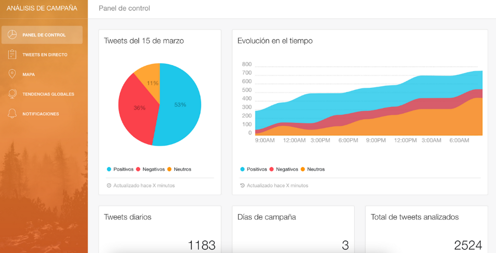
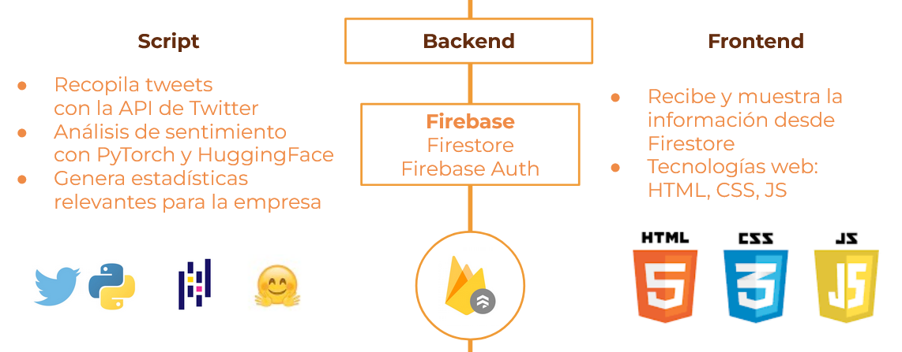

# Firebird

Firebird recolecta todos los tweets publicados en España sobre un tema objetivo y los analiza con un sistema de procesamiento de lenguaje natural basado en Pytorch y HuggingFace. La información obtenida se almacena en Google Firestore y se muestra de forma gráfica.

Esta aplicación es la actividad final de la asignatura Proyecto de Big Data.

**Nota**: el frontend de esta aplicación está todavía en desarrollo. Hay disponible una proof of concept en [este enlace](https://af2047.github.io/firebird-dashboard/login/). Las credenciales de acceso son:

* **Usuario**: test1@fakeemail.com
* **Contraseña**: prueba

## Tecnologías utilizadas

* **Landing page**: React
* **Panel de control**: Chartist, Leaflet
* **Análisis**: HuggingFace, Pytorch 
* **Almacenamiento**: Firestore
* **Autentificación de usuarios**: Firebase Auth

Emplea los siguientes recursos:

* Plantilla para landing page: [React Landing Page](https://github.com/issaafalkattan/React-Landing-Page-Template), de [Issaaf Kattan](https://github.com/issaafalkattan)
* Plantilla para panel de control: [Light Bootstrap Dashboard](https://www.creative-tim.com/product/light-bootstrap-dashboard), de [Creative Tim](creative-tim.com)
* Modelo PLN: [bert-base-multilingual-uncased-sentiment](https://huggingface.co/nlptown/bert-base-multilingual-uncased-sentiment), de [NLP Town](https://www.nlp.town/)